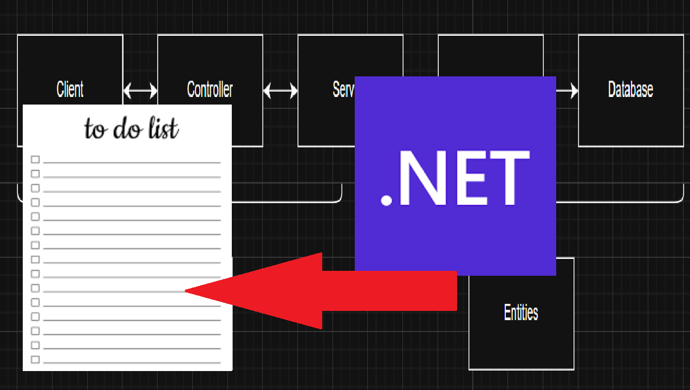
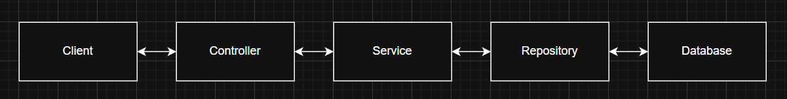

# myRESTAPI 

This project is a production grade web API. I am trying to follow all the professional rules for the architecture.  
It is able to store tasks, like the typical todo list project.

## Video
<table>
<tr>
<td>
  <a href="https://youtu.be/lnvgA3NUfUg">
    
  </a>
</td>
<td>
  I have made a quick video going over the project. In the video I'm going over how it works, every folders purpose, and I'll give a demonstration of every endpoint. Click the image to the left to go there!
</td>
</tr>
</table>

#### The API includes:
1. A REST controller (API/Controllers/TasksController.cs)
2. A business logic layer (Application/Services/TaskService.cs)
3. A data access layer (Infrastructure/Repositories/TaskRepository.cs)
4. Database entities (Domain/Entities/TaskEntity.cs)
5. DTO's (Data Transfer Objects) for input and output (Application/DTOs)
6. Dependency injection wiring (API/Program.cs)
7. App config (API/appsettings.json)

## 🏢 Architecture overview

This project will follow a layered architecture:



This will make the system easily maintainable, scalable and easy to work with. I got most of the inspiration for this design from this website: [learn.microsoft.com/en-us/aspnet](https://learn.microsoft.com/en-us/aspnet/core/fundamentals). Also, I used chatGPT a bit to help me with some of the syntaxes of uncommon things and with weird errors I didn't understand along the way.

## 📦 Database
For my database, I chose to go with SQLite. I chose this because it is easy to work with, and works well for small apps like this one. I have used postgreSQL before, but not SQLite. I could have gone for SQL Server, but for this project I want to focus fully on the architecture and the C# coding I have to be doing. Adding a database I don't know yet would be too much for one project. 

## ⚒️ What each part does

### 🥃 API/Program.cs
This file, Program.cs, configures the app and sets everything up. The settings are imported from appsettings.json
This part also fully sets up EF Core DbContext, and builds and runs the app.

### 🎮 API/Controllers
This part will be receiving the actual Http requests:  
- ```POST /api/tasks``` => Creates a task
- ```GET /api/tasks``` => Gets all tasks
- ```GET /api/tasks/{id}``` => Gets a single task
- ```PUT /api/tasks/{id}``` => Updates a task
- ```DELETE /api/tasks/{id}``` => Deletes a task
- ```PUT /api/tasks/{id}/complete``` => Marks a task as being completed
It also validates incoming data and maps all of it to the classes I have made.
It then contacts the next layer. The controllers do not do any business logic. It is just a 'dumb' file that moves data.

### 👨‍🍳 Application/Services
This is where all the more complicated logic lives. For example, this part checks whether every task has a title (which is required).
This part also converts DTOs into entities for the database. 

### ✉️ Application/DTOs
The DTOs define what information the user should receive or input. For example, a CreateTaskDTO only needs the things a user has to input; title, description and deadline. A TaskResponseDTO contains all the information that entities contain as well.  

### 💾 Infrastructure/Repositories
This is the part that communicates with the database. There are multiple functions available: CreateTask, GetById, GetAllTasks, DeleteTask. 
Right now this part is ready for implementation, I am going to build the database part later and hook this up to it. 

### 📕 Domain/Entities
This part defines what our database entities have to look like. 

### 📟 appsettings.json
This file includes:
- Logging settings
- Allowed Hosts
- Connection strings
- App settings
- Cors (Cross origin resource sharing) details  

## 🚀 How to run
1. First you have to restore all the packages:
``` 
dotnet restore
```
2. Then you apply the migrations and create the database:
```
dotnet ef database update --project ./Infrastructure/Infrastructure.csproj --startup-project ./API/API.csproj
```
3. After that you can run the API by doing:
```
dotnet run --project ./API/API.csproj
```
4. Done!

You should be seeing something like ```Now listening on: http://localhost:5000```. If so, the API is working. Then you can test all the endpoints with curl commands for example.

### Example curl commands

#### Create task:
```
curl -X POST "http://localhost:5000/api/v1/tasks" -H "Content-Type: application/json" -d '{"title":"Put title here","description":"Testing the POST endpoint","deadline":"2025-01-01T00:00:00Z"}'
```

#### Get all tasks:
```
curl -X GET "http://localhost:5000/api/v1/tasks"
```

#### Get task by ID:
```
curl -X GET "http://localhost:5000/api/v1/tasks/task id here"
```

#### Update task:
```
curl -X PUT "http://localhost:5000/api/v1/tasks/task id here" -H "Content-Type: application/json" -d '{"title":"Put updates title here","description":"Put updated description here","deadline":"2026-01-01T00:00:00Z"}'
```

#### Complete task:
```
curl -X POST "http://localhost:5000/api/v1/tasks/task id here/complete"
```

#### Delete task:
```
curl -X DELETE "http://localhost:5000/api/v1/tasks/task id here"
```